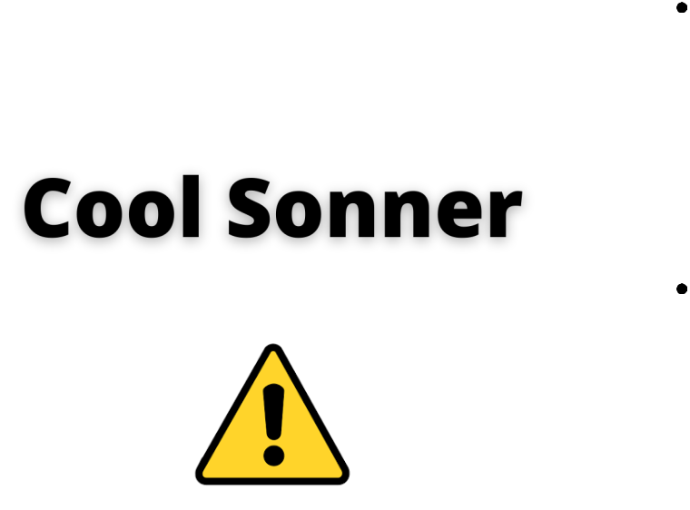
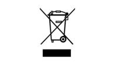

# Safety Instruction Manual

**Safety Information**

Avoid dropping the device.

Do not disassemble the

device.

Prevent the device from being submerged in water. Do not wear the device during activities like showering or swimming. Avoid exposure to extreme temperature.

Use the original cables

provided.

Clean with a dry and soft

cloth. Do not use cleansing

liquids or oil.

Keep out of reach of

children. Small parts

included may cause a

choking hazard.

**Hearing Safety**

Do not listen for a long duration at high volume to avoid hearing damage.

Do not turn on maximum volume so that you're unable to hear your surroundings.

Do not use earphones while driving.

Keep the volume minimum when walking, jogging or exercising to grasp warning noise like horns, sirens etc.

**Notice**

Cool Sonner complies with the radio interference requirements of the European Community. CAUTION

RISK OF EXPLOSION IF AN INCORRECT TYPE OF BATTERY REPLACEMENT. DISCARD THE BATTERIES ACCORDING TO THE INSTRUCTIONS PROVIDED.

This symbol depicts the product must not be discarded as household waste and should be delivered to an appropriate collection facility for recycling. Follow the rules and never discard the product and rechargeable batteries with regular household waste. Correct dispatch of old products and rechargeable batteries helps prevent fatal consequences for the environment and human health.

